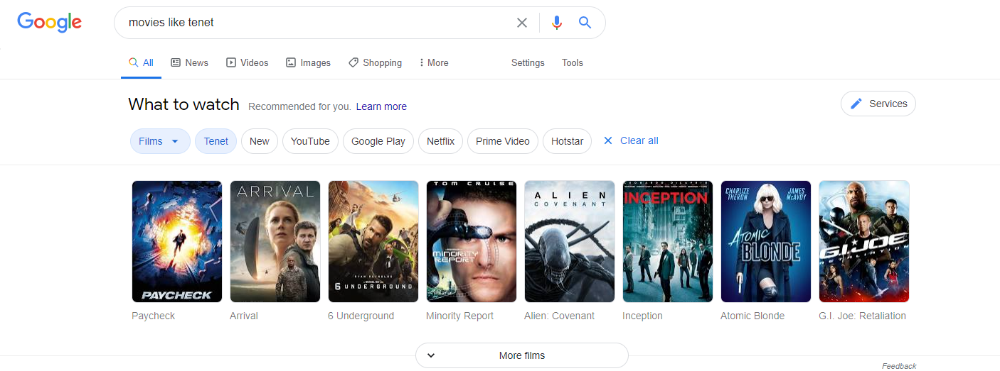

## Movie Recommendation Engine

### Goal

In this project we built a movie recommendation engine using content based filtering.

### Approach

First we read data from the .csv file using pandas.

After having a look at the data it can be said that there are many unneccessary info about the movie in data.

So we pick out the relevant or important features that are need to make predictions.

In our case **['keywords','cast','genres','director']** were the relevant features.

After this we combined all the values from the above features into a single string that we would later transform into a vector using **CountVectorizer()** from scikit-learn.

We computed **Cosine Similarity** between the content representing vectors of various movies to find the movies similar to the cureent user's liking.

### Toolset

Pandas nad scikit-learn were used for this project.

### Data

The data used in this project can be downloaded from [here on Kaggle](https://www.kaggle.com/tmdb/tmdb-movie-metadata).

### Implementation

Implementation of the approach can be found in the Movies_Recommendation_Engine.ipynb located in the main directory.

### Contact

I hope you found this useful. If you have any feedback, I’d love to hear it.

If you’d like to inquire about collaboration or career opportunities you can find me [here on LinkedIn](https://www.linkedin.com/in/aditya-halder-007/).
